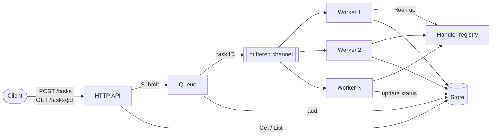
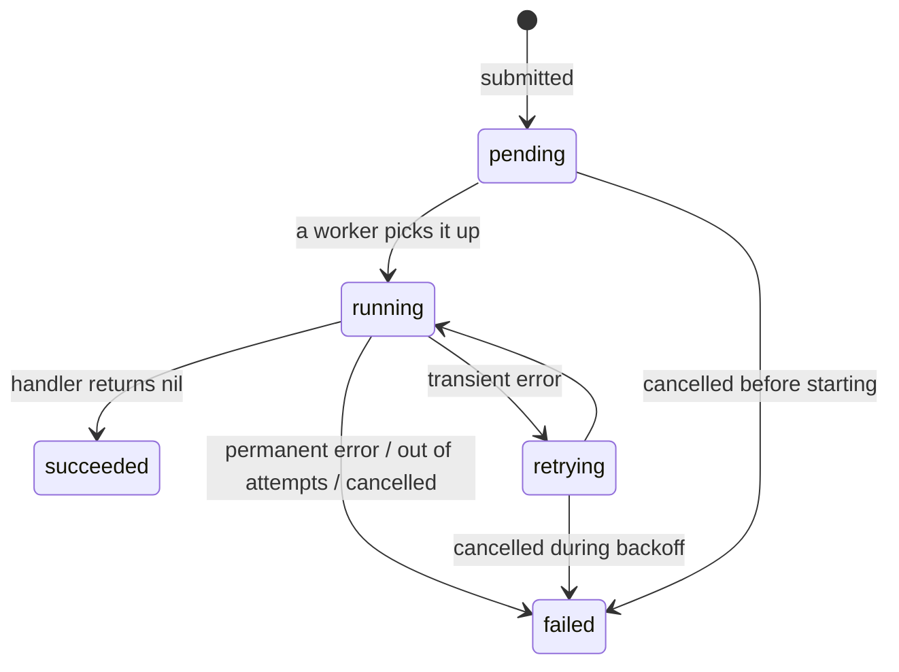

# task-queue

[](https://github.com/Gary-Qin/task-queue/actions/workflows/ci.yml)

An in-memory background task queue in Go. Clients submit jobs over HTTP and get an ID back immediately. A pool of workers runs the jobs in the background and retries transient failures with exponential backoff. On shutdown, the server drains in-flight work within a deadline. Built on the standard library alone, apart from `google/uuid`.

## Features

- **Typed tasks:** each task has a type and a JSON payload, and the registry maps task types to handler functions.
- **Bounded, buffered queue:** when the buffer is full, submissions are rejected with `503` instead of blocking.
- **Worker pool:** the number of concurrent workers is configurable.
- **Status tracking:** every task can be looked up through its lifecycle (`pending → running ⇄ retrying → succeeded | failed`).
- **Retries:** exponential backoff with full jitter. Handlers can mark an error as permanent so it isn't retried.
- **HTTP API:** submit, get and list tasks as JSON.
- **Graceful shutdown:** on Ctrl+C the server stops accepting requests and lets queued tasks finish. If the deadline passes, it cancels running handlers.
- **Structured logging** with `log/slog`, in text or JSON format.

## Architecture



| Component      | Package          | Role                                                                                       |
| -------------- | ---------------- | ------------------------------------------------------------------------------------------ |
| Task, Registry | `internal/task`  | The task model, lifecycle statuses, the handler signature, and the type → handler registry |
| Queue          | `internal/queue` | The buffered channel of task IDs, the worker pool, retries, and shutdown                   |
| Store          | `internal/queue` | A mutex-protected map of tasks that hands out copies, in submission order                  |
| API            | `internal/api`   | HTTP handlers, maps errors to status codes, logs each request                              |
| Server         | `cmd/server`     | Flags, logging setup, demo handlers, signal handling                                       |

### Task lifecycle



## Quick start

Requires Go 1.26+.

```bash
go run ./cmd/server
```

```bash
# submit a task
curl -X POST localhost:8080/tasks -d '{"type":"flaky","maxAttempts":5}'

# check on it
curl localhost:8080/tasks/<id>
```

Press Ctrl+C to shut down gracefully.

### Flags

| Flag                | Default | Description                                               |
| ------------------- | ------- | --------------------------------------------------------- |
| `-addr`             | `:8080` | HTTP listen address                                       |
| `-workers`          | `4`     | Number of tasks to run at once                            |
| `-buffer`           | `100`   | Number of tasks that can wait to run                      |
| `-retry-base-delay` | `100ms` | Delay before the first retry; doubles on each later retry |
| `-retry-max-delay`  | `10s`   | Maximum delay between retries                             |
| `-shutdown-timeout` | `30s`   | Time allowed for in-flight work to finish on shutdown     |
| `-log-level`        | `info`  | `debug`, `info`, `warn`, or `error`                       |
| `-log-format`       | `text`  | `text` or `json`                                          |

Invalid values are rejected with exit code 2. Run with `-h` for the full usage.

### Demo task types

The server registers three example handlers so you can see each behavior:

| Type    | Behavior                                                      |
| ------- | ------------------------------------------------------------- |
| `sleep` | Waits 5–20s, then succeeds                                    |
| `flaky` | Waits 0.5–2s, then fails with a transient error half the time |
| `bad`   | Always fails with a permanent error, so it's never retried    |

## API

### `POST /tasks`: submit a task

```bash
curl -i -X POST localhost:8080/tasks -d '{"type":"flaky","payload":{"n":1},"maxAttempts":5}'
```

| Field         | Required | Description                                     |
| ------------- | -------- | ----------------------------------------------- |
| `type`        | yes      | A registered task type                          |
| `payload`     | no       | Any JSON value, passed to the handler unchanged |
| `maxAttempts` | yes      | Total attempts allowed, at least 1              |

```
HTTP/1.1 202 Accepted
{"id":"42f0a289-5adb-4dbc-9f36-5cd94a6d9035"}
```

### `GET /tasks/{id}`: get a task

```bash
curl localhost:8080/tasks/42f0a289-5adb-4dbc-9f36-5cd94a6d9035
```

```json
{
  "id": "42f0a289-5adb-4dbc-9f36-5cd94a6d9035",
  "type": "flaky",
  "payload": { "n": 1 },
  "status": "retrying",
  "attemptCount": 2,
  "maxAttempts": 5,
  "error": "transient",
  "createdAt": "2026-10-04T20:37:36.9557291-04:00",
  "startedAt": "2026-10-04T20:37:36.9557291-04:00"
}
```

`error` holds the most recent failure. `startedAt` and `doneAt` are left out until they happen.

### `GET /tasks`: list all tasks

Returns an array of tasks in submission order. If there are none, it returns `[]`.

### Errors

Errors return a JSON body of the form `{"error": "..."}`.

| Status                         | When                                                    |
| ------------------------------ | ------------------------------------------------------- |
| `400 Bad Request`              | Malformed JSON, unknown task type, or `maxAttempts` < 1 |
| `404 Not Found`                | No task with that ID                                    |
| `405 Method Not Allowed`       | Wrong method for the path                               |
| `413 Request Entity Too Large` | Request body over 1 MB                                  |
| `503 Service Unavailable`      | Queue is full, or the server is shutting down           |
| `500 Internal Server Error`    | Unexpected error. Details are logged, not returned.     |

## Logging

Logs are written to stderr with `log/slog`. Every line about a task carries the same keys (`task_id`, `task_type`, `worker`, `attempt`), so you can pull out one task's full history with a single search:

```
level=WARN msg="attempt failed, retrying" worker=2 task_id=e91c… task_type=flaky attempt=1 max_attempts=5 backoff=83ms err=transient
level=INFO msg="task succeeded" worker=2 task_id=e91c… task_type=flaky attempt=2
level=INFO msg=request method=POST path=/tasks status=202 duration=2.05ms
```

Use `-log-format json` for log aggregators, and `-log-level debug` to see each attempt start.

## Testing

```bash
go test -race ./...
```

The tests cover retry behavior (success after failures, running out of attempts, permanent errors), shutdown interrupting a backoff, every API status code, list ordering, and flag parsing. CI runs `gofmt`, `go vet`, and the race-enabled tests on every push.

## Project layout

```
cmd/server/        entry point: flags, logging, demo handlers, signal handling
internal/task/     task model, statuses, handler registry
internal/queue/    queue, worker pool, retries, shutdown, task store
internal/api/      HTTP handlers and request logging
```

## Design decisions

### Backpressure: reject instead of block

`Submit` sends to the buffered channel with a non-blocking `select`. If the buffer is full, the task is removed from the store and `Submit` returns `ErrQueueFull`, which the API turns into `503 Service Unavailable`.

The alternative was to block until there's room. That would hold HTTP requests and their goroutines open for as long as the queue stays backed up, so a burst of traffic would turn into growing memory use and client timeouts. A `503` is a fast, clear answer: "busy, try again later," and clients and load balancers already know how to handle it. The cost is that clients have to retry when they're rejected, and the buffer size needs choosing based on the expected load.

### Retries: exponential backoff with full jitter, and permanent errors

After a failed attempt, the worker waits a random time between 0 and `base × 2^(attempt−1)`, capped at `-retry-max-delay`. The doubling **slows retries down** when a dependency is struggling. The randomness (**jitter**) spreads out tasks that failed together, so they don't all retry at the same instant and overload a recovering service again (the "thundering herd" problem). The delay is doubled in a loop, not with a bit shift, so a large attempt number can't overflow into a negative or zero delay.

Not every error is worth retrying. A handler signals "retrying won't help" by returning `task.Permanent(err)`, which wraps `ErrPermanent`. The worker checks for it with `errors.Is` and fails the task immediately. Errors caused by shutdown are never retried either.

### Graceful shutdown: HTTP first, then the queue, against a deadline

On Ctrl+C:

1. **The HTTP server shuts down first**, so no new submissions arrive while the queue drains. In-flight requests finish normally.
2. **The queue closes.** A `closed` flag is set and the channel is closed under the same lock that `Submit` holds while it sends. So a late `Submit` gets `ErrQueueClosed` instead of panicking on a send to a closed channel.
3. **Workers drain** the tasks still in the buffer.
4. **If the deadline passes first**, the workers' context is cancelled. Running handlers are told to stop, and the remaining tasks are marked failed instead of being run. `Shutdown` then waits for every worker to exit before returning.

Three separate contexts keep these signals apart:

- the Ctrl+C context decides _when_ shutdown starts
- the workers' context is cancelled only by `Shutdown`
- a timeout context limits _how long_ shutdown can take

If the Ctrl+C context were passed to the workers, Ctrl+C would cancel every handler immediately, with no draining at all. After the first Ctrl+C, the signal handler is removed, so a second Ctrl+C kills the process outright.

The cost: cancellation in Go is cooperative, so a handler that ignores its `ctx` can delay shutdown indefinitely.

### Limitations

- **Tasks aren't saved anywhere.** They live in memory, so a crash or restart loses everything, including tasks the client was told were accepted. Making them survive a restart would mean storing them in something like SQLite or Redis, and re-queuing anything that was running when the process died.
- **Handlers must be idempotent** (safe to run more than once). Retries run a handler again after a failure, and a handler that failed partway through, say after sending an email but before returning, will repeat that side effect.
- **Finished tasks are never removed**, so the store grows without limit. A real deployment would expire finished tasks after some time.
- **No per-task timeout.** A handler that hangs holds its worker until shutdown.
- **Single process.** Workers can't run on more than one machine, because the queue and the store are both in memory.
